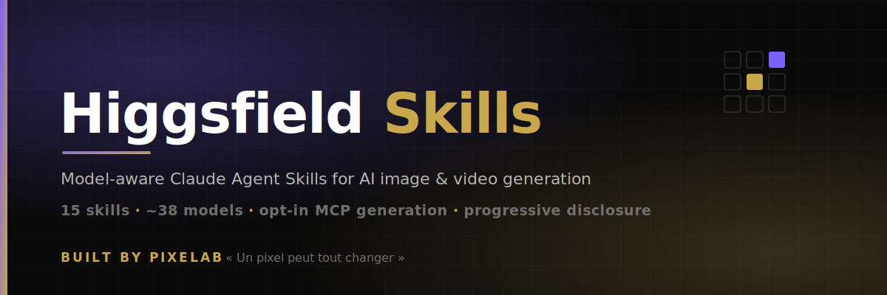

🌐 **English / 简体中文** | [日本語](README.ja.md) | [한국어](README.ko.md) | [Español](README.es.md) | [Deutsch](README.de.md) | [Français](README.fr.md) | [Português](README.pt.md) | [Türkçe](README.tr.md) | [繁體中文](README.zh-TW.md)

---

<p align="center">
  <a href="https://higgsfield.ai/create/video?model=seedance_2_0">
    
  </a>
</p>

<p align="center">
  <strong>🎬 higgsfield-seedance2-jineng</strong><br>
  <em>Seedance 2.0 × Higgsfield 技能集 | Prompt Engineering Skills Collection</em>
</p>

<p align="center">
  <a href="https://higgsfield.ai">Higgsfield</a> ·
  <a href="https://higgsfield.ai/create/video?model=seedance_2_0">创建视频 Create Video</a> ·
  <a href="https://x.com/higgsfield">𝕏 @higgsfield</a>
</p>

---

# 这是什么？ What Is This?

15 个专业 Claude 技能，专为 Seedance 2.0（Higgsfield）打造。每个技能将 Claude 变成特定视频风格的提示词工程师——生成大型、详细、可直接使用的提示词，包含强力 **2 秒钩子**，让观众停止滑动。

15 specialized Claude skills built for Seedance 2.0 on Higgsfield. Each skill turns Claude into a prompt engineer for a specific video style — generating large, detailed, paste-ready prompts with powerful **2-second hooks** that stop the scroll.

👉 **[立即在 Higgsfield 上创建视频 Start creating on Higgsfield](https://higgsfield.ai/create/video?model=seedance_2_0)**

---

<p align="center">
  
</p>

## 每个技能包含 What Each Skill Contains

- **2 秒钩子框架 / 2-Second Hook Framework** — 10-12 种抓取注意力的开场模式 | 10-12 attention-grabbing opener patterns
- **时间线分段 / Timeline Segmentation** — 逐拍分解，最长 15 秒 | Beat-by-beat breakdown up to 15s
- **摄像机运动百科 / Camera Movement Encyclopedia** — 15-20+ 技术及精确提示词 | 15-20+ techniques with exact phrasing
- **灯光与氛围 / Lighting & Atmosphere** — 传达情绪和品质的布光方案 | Setups that communicate mood and quality
- **声音设计 / Sound Design** — 环境音、拟音、音乐、静默 | Ambient, foley, music, silence
- **素材引用策略 / Material Reference Strategy** — `@image1` `@video1` `@audio1` 的最佳用法 | Best practices for references
- **平台优化 / Platform Optimization** — 抖音、TikTok、Instagram、YouTube 等 | Cross-platform adjustments
- **5+ 大型示例提示词 / 5+ Large Example Prompts** — 每个 15-25 行，制作级品质 | 15-25 lines each, production-quality

---

## 🎯 15 个技能 The 15 Skills

### 创意风格 Creative Styles

| # | 技能 Skill | 用途 Use Case |
|---|---|---|
| 01 | [电影风格 Cinematic](skills/01-cinematic/SKILL.md) | 影视品质 — 戏剧性光影、镜头语言、景深、调色 | Film quality — dramatic lighting, camera language, depth of field |
| 02 | [3D CGI](skills/02-3d-cgi/SKILL.md) | 3D 渲染 — Pixar、虚幻引擎、照片级、等距 | 3D rendered — Pixar, Unreal Engine, photorealistic, isometric |
| 03 | [卡通动画 Cartoon](skills/03-cartoon/SKILL.md) | 2D 动画 — 赛璐璐、手绘、扁平矢量、水彩 | 2D animation — cel-shaded, hand-drawn, flat vector, watercolor |
| 04 | [漫画转视频 Comic to Video](skills/04-comic-to-video/SKILL.md) | 动态漫画 — 漫画、条漫、分镜、连续画面 | Animate comics — manga, webtoons, storyboards |
| 05 | [打斗场景 Fight Scenes](skills/05-fight-scenes/SKILL.md) | 动作 — 武术、剑战、追逐、超级英雄 | Action — martial arts, sword fights, chase, superhero |
| 08 | [动漫 Anime](skills/08-anime-action/SKILL.md) | 日本动漫 — 少年、青年、机甲、日常、OP | Anime — shonen, seinen, mecha, slice-of-life, openings |

### 商业营销 Commercial & Marketing

| # | 技能 Skill | 用途 Use Case |
|---|---|---|
| 06 | [动态设计广告 Motion Design Ad](skills/06-motion-design-ad/SKILL.md) | 软件/SaaS — 产品发布、功能展示 | Software/SaaS — product launches, feature showcases |
| 07 | [电商广告 E-Commerce Ad](skills/07-ecommerce-ad/SKILL.md) | 产品广告 — 时尚、美妆、电子、食品 | Product ads — fashion, beauty, electronics, food |
| 09 | [产品 360° Product 360](skills/09-product-360/SKILL.md) | 转盘展示 — 多角度、主视觉、材质 | Turntable — multi-angle, hero shots, material showcase |
| 11 | [社交钩子 Social Hook](skills/11-social-hook/SKILL.md) | 病毒内容 — 抖音/TikTok/Reels/Shorts | Viral content — scroll-stopping hooks |
| 12 | [品牌故事 Brand Story](skills/12-brand-story/SKILL.md) | 品牌叙事 — 创业故事、使命、企业文化 | Brand narrative — origin stories, mission, culture |

### 行业专项 Industry-Specific

| # | 技能 Skill | 用途 Use Case |
|---|---|---|
| 10 | [音乐视频 Music Video](skills/10-music-video/SKILL.md) | 节拍同步 — 表演、叙事、可视化 | Beat-synced — performance, narrative, visualizers |
| 13 | [时尚型录 Fashion Lookbook](skills/13-fashion-lookbook/SKILL.md) | 时尚 — 型录、走秀、穿搭、品牌活动 | Fashion — lookbooks, walks, outfits, campaigns |
| 14 | [美食饮品 Food & Beverage](skills/14-food-beverage/SKILL.md) | 美食 — 餐厅、食谱、ASMR、食欲诱惑 | Food — restaurant, recipe, ASMR, appetite appeal |
| 15 | [房地产 Real Estate](skills/15-real-estate/SKILL.md) | 房产 — 房屋参观、建筑、室内设计 | Property — tours, architecture, interior design |

> 📝 每个技能都有中文版本 Each skill has a Chinese version: `skills/XX-name/zh-CN/SKILL.md`

---

## 🚀 快速开始 Quick Start

### 安装技能 Install a Skill

1. 将 `SKILL.md` 复制到 Claude 技能目录 | Copy `SKILL.md` to your Claude skills directory
2. 描述你想创建的视频 | Describe the video you want to create
3. Claude 生成制作级提示词 | Claude generates a production-ready prompt
4. 粘贴到 [Seedance 2.0（Higgsfield）](https://higgsfield.ai/create/video?model=seedance_2_0) | Paste into Seedance 2.0 on Higgsfield with your materials

### 示例 Example

```
你: 我需要一个 15 秒电影风格视频，孤独武士在黎明雾气竹林中行走
You: I need a 15s cinematic video of a lone samurai walking through foggy bamboo forest at dawn

Claude (使用电影技能 with cinematic skill):
→ 生成 25+ 行详细提示词 Generates 25+ line detailed prompt
→ 包含时间线、镜头、灯光、声音、2 秒钩子 With timeline, camera, lighting, sound, 2-second hook
```

---

## 📋 Seedance 2.0（Higgsfield）参数规格 Specs

| 输入 Input | 格式 Format | 限制 Limit |
|---|---|---|
| 图片 Image | jpeg, png, webp, bmp, tiff, gif | ≤ 9 个, 每个 < 30MB |
| 视频 Video | mp4, mov | ≤ 3 个, 每个 < 50MB, 总时长 2–15s |
| 音频 Audio | mp3, wav | ≤ 3 个, 每个 < 15MB, 总时长 ≤ 15s |
| 文本 Text | 自然语言 Natural language | — |
| **合计 Combined** | — | **≤ 12 个文件 files** |
| **输出 Output** | 视频 Video | **4–15s, 720p, 含声音 with sound** |

素材引用 Reference materials: `@image1` `@video1` `@audio1`

---

## 📁 仓库结构 Repository Structure

```
higgsfield-seedance2-jineng/
├── README.md                          # 双语说明 Bilingual readme (this file)
├── LICENSE
├── logs.md                            # 构建日志 Build log
└── skills/
    ├── 01-cinematic/
    │   ├── SKILL.md                   # English
    │   └── zh-CN/SKILL.md            # 简体中文
    ├── 02-3d-cgi/
    ├── 03-cartoon/
    ├── 04-comic-to-video/
    ├── 05-fight-scenes/
    ├── 06-motion-design-ad/
    ├── 07-ecommerce-ad/
    ├── 08-anime-action/
    ├── 09-product-360/
    ├── 10-music-video/
    ├── 11-social-hook/
    ├── 12-brand-story/
    ├── 13-fashion-lookbook/
    ├── 14-food-beverage/
    └── 15-real-estate/
        ├── SKILL.md
        └── zh-CN/SKILL.md
```

---

## 📊 统计 Stats

- **技能数量 Skills:** 15
- **文件总数 Total files:** 30 个 SKILL.md (15 EN + 15 ZH)
- **总行数 Total lines:** 31,725
- **语言 Languages:** English + 简体中文

---

## 🤝 贡献 Contributing

欢迎 PR！Welcome PRs!

1. 遵循 SKILL.md 格式 | Follow SKILL.md format (YAML frontmatter + content)
2. 包含 2 秒钩子框架 | Include the 2-Second Hook Framework
3. 包含 5+ 大型示例 | Include 5+ large example prompts
4. 提供英文和中文版本 | Provide English + Chinese versions
5. 在 [Seedance 2.0（Higgsfield）](https://higgsfield.ai/create/video?model=seedance_2_0) 上测试 | Test on Seedance 2.0 on Higgsfield

---

## 🔗 相关资源 Related

- [Higgsfield](https://higgsfield.ai) — 平台主页 Platform home
- [Seedance 2.0 创建视频 Create Video](https://higgsfield.ai/create/video?model=seedance_2_0) — 直接开始 Start now
- [𝕏 @higgsfield](https://x.com/higgsfield) — 关注最新动态 Follow for updates
---

`seedance` `higgsfield` `ai-video` `claude-skills` `prompt-engineering` `视频生成` `技能集` `提示词工程`
