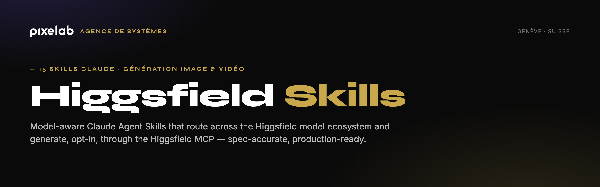

<p align="center">
  <a href="https://pixelab.ch">
    
  </a>
</p>

<p align="center">
  <strong>Higgsfield Skills — Multi-Model Prompt & Generation Toolkit</strong><br>
  <em>15 Claude Agent Skills for AI image and video generation on the Higgsfield platform</em>
</p>

<p align="center">
  <a href="https://higgsfield.ai">Higgsfield</a> ·
  <a href="https://x.com/higgsfield">X @higgsfield</a> ·
  <a href="LICENSE">License</a>
</p>

<p align="center">
  <sub>⚡ Built by <a href="https://pixelab.ch"><strong>Pixelab</strong></a> — the Swiss AI &amp; systems agency that designs and ships production systems like this one. <a href="mailto:contact@pixelab.ch">Let's build yours.</a></sub>
</p>

---

## What Is This?

A collection of **15 Claude Agent Skills** that turn Claude into an expert prompt engineer for AI image and video generation on the [Higgsfield](https://higgsfield.ai) platform. Each skill covers a creative style or use case, produces a production-ready prompt, routes it to the most appropriate Higgsfield model, and — on explicit user confirmation — can submit the generation directly through the Higgsfield MCP server.

**You do not need to know which of the ~38 Higgsfield models to pick or what parameters each accepts.** The skills handle model routing, parameter validation, and the generation workflow for you.

---

## The 15 Skills

| # | Skill name | Use case |
|---|-----------|---------|
| 01 | `higgsfield-cinematic` | Film-quality video — dramatic lighting, camera language, depth of field, color grading |
| 02 | `higgsfield-3d-cgi` | 3D rendered visuals — Pixar-style, Unreal Engine, photorealistic, isometric |
| 03 | `higgsfield-cartoon` | 2D animation — cel-shaded, hand-drawn, flat vector, watercolor |
| 04 | `higgsfield-comic-to-video` | Animate comics — manga panels, webtoons, storyboards to video |
| 05 | `higgsfield-fight-scenes` | Action — martial arts, sword fights, chase sequences, superhero |
| 06 | `higgsfield-motion-design-ad` | Software/SaaS ads — product launches, feature showcases, UI demos |
| 07 | `higgsfield-ecommerce-ad` | Product ads — fashion, beauty, electronics, food with still + video |
| 08 | `higgsfield-anime-action` | Japanese anime — shonen, seinen, mecha, slice-of-life, openings |
| 09 | `higgsfield-product-360` | Turntable reveals — multi-angle, hero shots, material showcase |
| 10 | `higgsfield-music-video` | Beat-synced visuals — performance, narrative, audio-driven generation |
| 11 | `higgsfield-social-hook` | Viral short-form — scroll-stopping hooks for TikTok/Reels/Shorts |
| 12 | `higgsfield-brand-story` | Brand narrative — origin stories, mission films, company culture |
| 13 | `higgsfield-fashion-lookbook` | Fashion — lookbooks, runway walks, outfit campaigns |
| 14 | `higgsfield-food-beverage` | Food — restaurant, recipe, ASMR, appetite-appeal videos |
| 15 | `higgsfield-real-estate` | Property — house tours, architecture walkthroughs, interior design |

---

## Model Routing Table

Each skill routes to a primary model and falls back to a second model when the primary is unavailable or unsuitable.

| Skill | Primary model | Fallback model |
|-------|--------------|----------------|
| 01-cinematic | `cinematic_studio_3_0` | `veo3_1` |
| 02-3d-cgi | `seedance_2_0` | `wan2_7` |
| 03-cartoon | `wan2_7` | `seedance_2_0` |
| 04-comic-to-video | `wan2_6` | `seedance_2_0` (I2V) |
| 05-fight-scenes | `cinematic_studio_3_0` | `kling3_0` |
| 06-motion-design-ad | `marketing_studio_video` | `seedance_2_0` |
| 07-ecommerce-ad | `marketing_studio_video` | `seedance_2_0` (+ `ms_image` for stills) |
| 08-anime-action | `wan2_7` | `wan2_6` (I2V) |
| 09-product-360 | `seedance_2_0` | `cinematic_studio_3_0` (I2V) |
| 10-music-video | `veo3_1` | `veo3_1_lite` (audio) |
| 11-social-hook | `kling3_0` | `grok_video` |
| 12-brand-story | `cinematic_studio_3_0` | `veo3_1` |
| 13-fashion-lookbook | `cinematic_studio_video_v2` | `seedance_2_0` |
| 14-food-beverage | `seedance_2_0` | `marketing_studio_video` |
| 15-real-estate | `cinematic_studio_3_0` | `veo3_1` |

---

## Opt-In Generation

**Generation never happens automatically.** Every skill follows this confirmation-gated flow:

1. **Build prompt** — Claude gathers your creative brief and produces a production-ready prompt with camera, lighting, timeline, and sound design details.
2. **Confirm** — Claude presents the assembled prompt, chosen model, parameters, and current credit cost/balance. You approve or adjust before anything is submitted.
3. **Generate** — On explicit confirmation, Claude calls the Higgsfield MCP server (`higgsfield:generate_video` or `higgsfield:generate_image`).
4. **Poll + display** — Claude monitors `higgsfield:job_status` until complete, then presents the result via `higgsfield:job_display`.

For skills that work with your uploaded media (04-comic-to-video, 08-anime-action, 09-product-360, 10-music-video), the flow also includes `higgsfield:media_upload` → `higgsfield:media_confirm` before the generation call.

---

## Output Constraints

Video output is up to **1080p**. There is no 4K video output and no `.webm` container. The `4k` value that appears in some model parameter enums (e.g. `kling3_0` mode) is a generation-pipeline setting, not an output-resolution guarantee.

Per-model constraints (aspect ratios, duration ranges, parameters) are documented in each skill's `references/model-specs.md` and sourced from live `models_explore` data verified 2026-05-24/25. At generation time, each skill calls `higgsfield:models_explore` to confirm the live schema before submitting.

---

## The Higgsfield Model Ecosystem

Approximately **38 models** aggregated from multiple providers, all accessible through one Higgsfield MCP server:

| Category | Count | Providers / families |
|----------|-------|---------------------|
| Video | ~18 | Higgsfield (Seedance 2.0/1.5, Cinematic Studio 3.0, Marketing Studio Video, Cinematic Studio Video v1/v2), Google (Veo 3, Veo 3.1, Veo 3.1 Lite), Bytedance (Wan 2.6, Wan 2.7), Kuaishou (Kling 2.6, Kling 3.0), xAI (Grok Video), MiniMax (Hailuo), Higgsfield Preset |
| Image | ~20 | Higgsfield (Nano Banana / 2 / Pro, Soul 2 / Cinematic / Cast / Location, Cinematic Studio 2.5, Marketing Studio Image, MS Image), Bytedance (Seedream v4.5, v5 Lite), Black Forest Labs (Flux 2, Flux Kontext), OpenAI (GPT Image, GPT Image 2), Kuaishou (Kling Omni Image), xAI (Grok Image), Z Image, Image Auto |

Model parameters, aspect ratios, and duration ranges vary by model and can change as Higgsfield updates its platform. Always treat the live `models_explore` catalog as the source of truth.

---

## Install

### Prerequisites

- [Claude Code](https://claude.ai/code) or Claude Desktop (macOS / Linux)
- The Higgsfield MCP server configured in your Claude environment (for generation — prompt-building works without it)

### Quick install

```bash
git clone https://github.com/higgsfield-ai/higgsfield-skills.git
cd higgsfield-skills
chmod +x install.sh
./install.sh          # Interactive — pick which skills to install
```

### Install all skills at once

```bash
./install.sh --all
```

Skills are installed to `~/.claude/skills/` (personal scope — works for both Claude Code and Claude Desktop on macOS and Linux). The `shared/` reference directory installs to `~/.claude/shared/`.

### Other options

```bash
./install.sh --list                   # List all 15 skills with descriptions
./install.sh --target project         # Install into ./.claude/skills/ (project-scoped, committable)
./install.sh --target code            # Explicit personal install (same as default)
./install.sh --target desktop         # Same path as code — both surfaces use ~/.claude/skills/
./install.sh --help                   # Full usage reference
```

### Project-scoped install

Commit `.claude/skills/` and `.claude/shared/` to your repo and anyone who opens it in Claude Code gets all the skills automatically — no script required.

### Windows

Automatic install is not supported. Copy `skills/<skill-name>/` manually to `%APPDATA%\.claude\skills\<skill-name>\` and `shared/` to `%APPDATA%\.claude\shared\`.

### After install

If you created `~/.claude/skills/` for the first time, restart Claude Code or Claude Desktop for skills to appear. Edits to existing installed skills take effect immediately without a restart.

---

## Repository Structure

```
higgsfield-skills/
├── README.md
├── LICENSE
├── install.sh                         # Installer (macOS / Linux)
├── assets/
│   ├── banner.png                     # README banner (Pixelab-branded)
│   └── social-preview.png             # GitHub social card (1280×640)
├── shared/                            # Cross-skill references (installed to ~/.claude/shared/)
│   ├── model-catalog.md               # All ~38 Higgsfield models, verified 2026-05-24
│   ├── generation-flow.md             # Canonical opt-in generation workflow
│   ├── skill-template.md              # SKILL.md authoring template + frontmatter rules
│   └── mcp-tools.md                   # Higgsfield MCP tool signatures
└── skills/
    ├── 01-cinematic/
    │   ├── SKILL.md
    │   └── references/
    │       ├── model-specs.md         # Per-skill model parameters (verified from models_explore)
    │       ├── camera.md
    │       ├── hooks.md
    │       └── examples.md
    ├── 02-3d-cgi/
    ├── 03-cartoon/
    ├── 04-comic-to-video/
    ├── 05-fight-scenes/
    ├── 06-motion-design-ad/
    ├── 07-ecommerce-ad/
    ├── 08-anime-action/
    ├── 09-product-360/
    ├── 10-music-video/
    ├── 11-social-hook/
    ├── 12-brand-story/
    ├── 13-fashion-lookbook/
    ├── 14-food-beverage/
    └── 15-real-estate/
        ├── SKILL.md
        └── references/
```

Each skill follows the same layout: a lean `SKILL.md` (model routing, generation workflow, links to references) and a `references/` directory with encyclopedic content loaded on demand.

---

## Stats

- **Skills:** 15
- **Files per skill:** SKILL.md + 4 reference files (model-specs, craft-specific, hooks, examples)
- **Supported Higgsfield models:** ~38 (image + video)
- **Language:** English

---

## Contributing

1. Follow the `SKILL.md` format documented in `shared/skill-template.md` (YAML frontmatter `name` + `description`; body ≤ 500 lines)
2. Keep encyclopedic content in one-level-deep `references/` files — do not chain references
3. Source all model specs from `higgsfield:models_explore` — no hardcoded resolutions or formats
4. Gate any generation behind explicit user confirmation
5. Test that the skill loads and routes correctly in Claude Code before opening a PR

See [CONTRIBUTING.md](CONTRIBUTING.md) for the full contributor guide.

---

## Related

- [Higgsfield](https://higgsfield.ai) — Platform home
- [Higgsfield MCP](https://higgsfield.ai/mcp) — MCP server setup
- [X @higgsfield](https://x.com/higgsfield) — Updates and releases

---

## Built by Pixelab

This toolkit was designed and built by **[Pixelab](https://pixelab.ch)** — a Swiss **AI & Systems agency** based in Geneva.

> *"Là où d'autres voient de la complexité, nous voyons des systèmes à construire."*
> *(Where others see complexity, we see systems to build.)*

This repository is a working example of what we ship for clients: reliable, documented, production-ready AI systems. We design and deliver them end to end — **conversational AI, workflow automation, web development, and custom AI tooling** — from audit and architecture through to production.

**Need a custom AI system built for your business? Let's talk.**

🌐 [pixelab.ch](https://pixelab.ch) &nbsp;·&nbsp; ✉️ [contact@pixelab.ch](mailto:contact@pixelab.ch) &nbsp;·&nbsp; 💼 [LinkedIn](https://www.linkedin.com/company/pixelab-ch) &nbsp;·&nbsp; 📍 Quai du Seujet 12, 1201 Genève, Suisse

---

## License & Credits

Released under the [MIT License](LICENSE).

We took the prompt-engineering skill collection
[`beshuaxian/higgsfield-seedance2-jineng`](https://github.com/beshuaxian/higgsfield-seedance2-jineng)
and reworked it to fit our own needs. The original creative prompt content was the starting
point; from there the project was substantially rebuilt — model-aware routing across the full
Higgsfield ecosystem, opt-in MCP generation, progressive-disclosure structure (lean `SKILL.md`
+ `references/`), a corrected installer, and per-model specs verified against
`higgsfield:models_explore`. We also kept it **English-only**, dropping the original's
incomplete multi-language translations. Credit to the original authors for the foundational
prompt craft.
